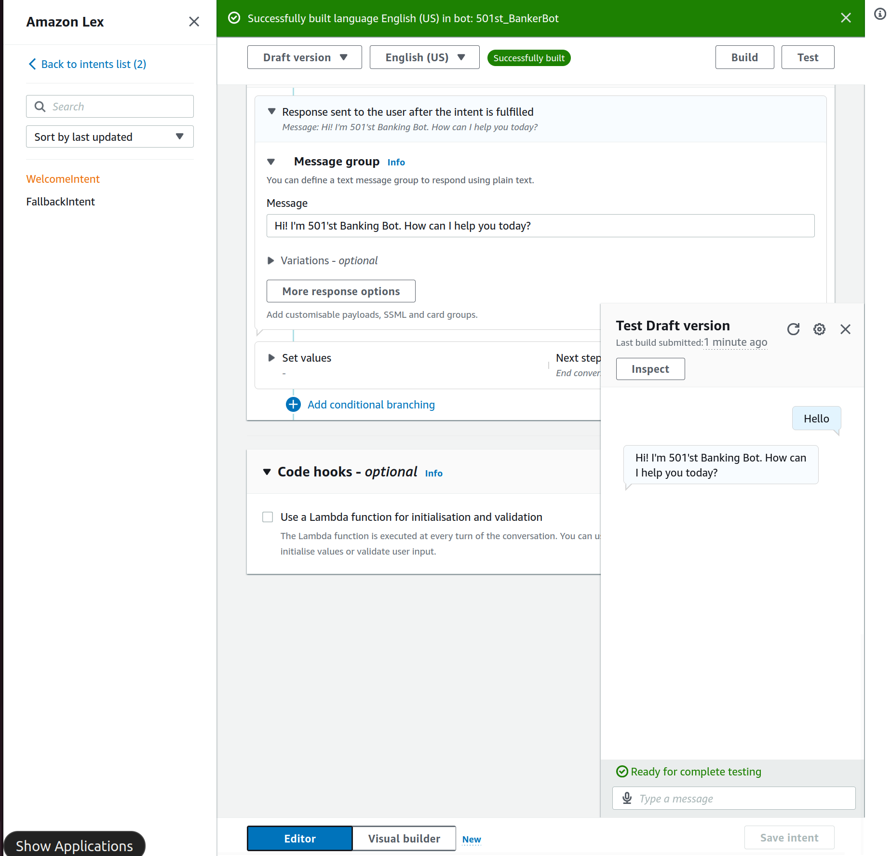
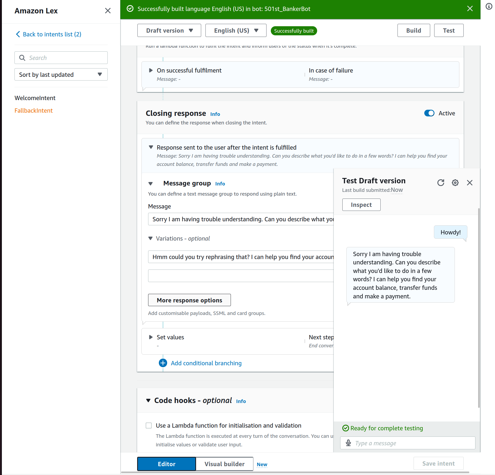
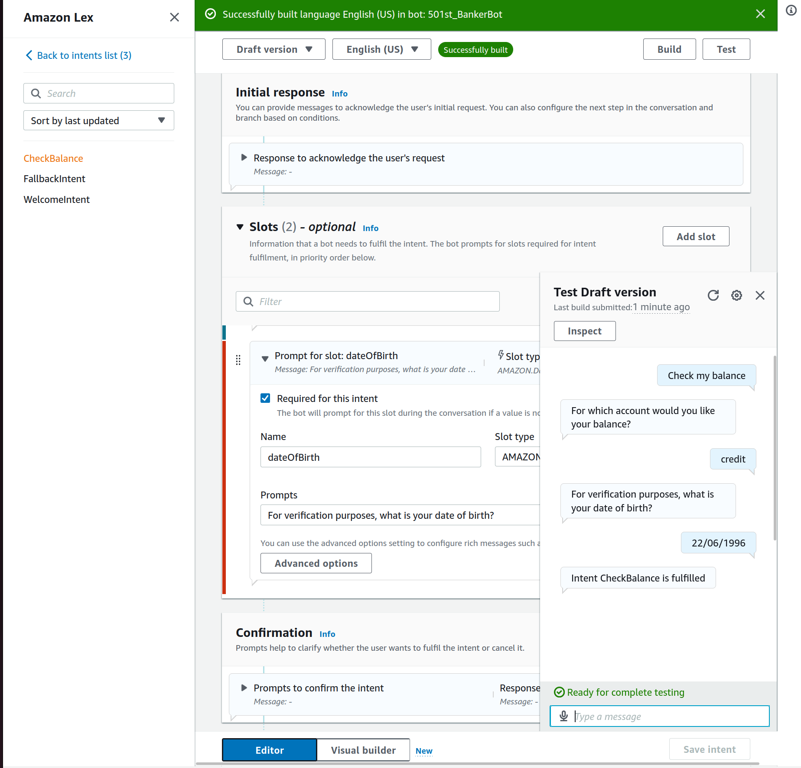
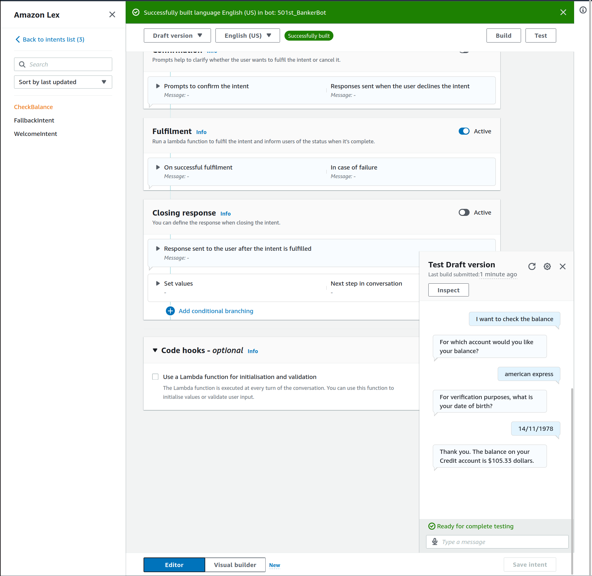
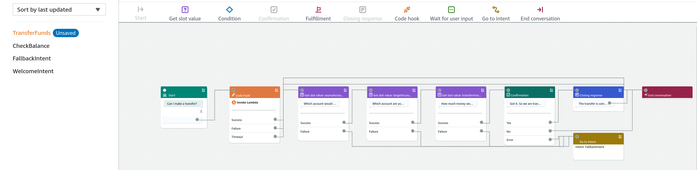

# AWS_LexBankingBot
A 501st Banking Bot utilises Amazon Lex: an AI tool for building conversational interfaces using voice and text, powered by the same deep learning technologies as Amazon Alexa.
There is a CloudFormation template also inspired by [NextWork](https://www.nextwork.org).

This basic 501st Banking Bot utilises Amazon Lex's key components:
- Intents       :    Definititions of what the bot is designed to do and what actions it should perform based on user input.
- Slots         :    Parameters or variables that the bot needs to fulfill an intent.
- Slot Types    :    Define the kind of data that a slot can hold.
- Prompts       :    Questions the bot asks the user to gather information for the slots.
- Fulfilment    :    What happens once the bot has collected all the necessary information. E.g. Invoke a Lambda function?
- Utterances    :    Various phrases or sentences that users might say to trigger an intent.
- Error Handling:    Managing scenarios where the bot doesn't understand the user's inpu.

### Technologies
- Amazon Lex
- Lamdba
- CloudFormation

### Welcome Intent

 
  

### Fallback Intent

 
  

### Check Balance Intent (Prior to Lamdba function connection)

 
  

### Check Balance Intent (With Lambda function connected)

 
  

## Transfer Funds Intent (With Error handling)

  
  

  
  

### Visual Builder 

 
  

